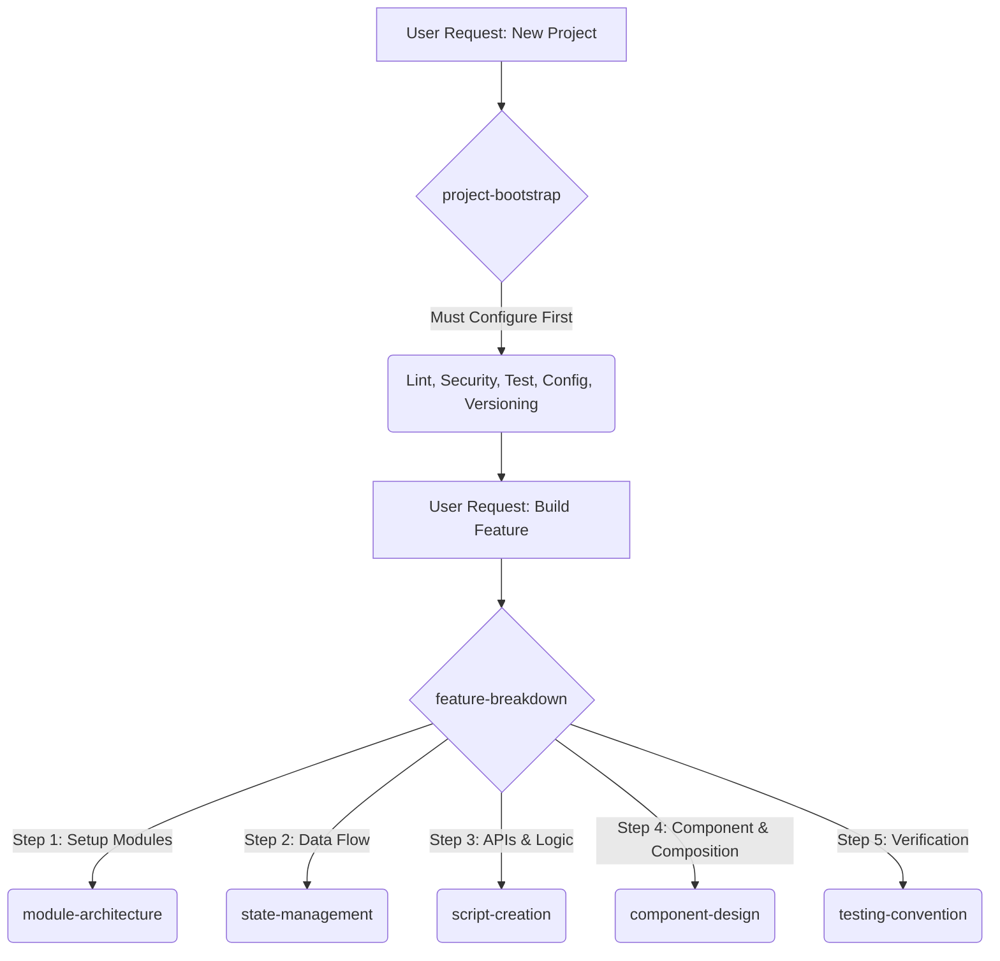

# f-skill


*F does not stand for fail. It doesn't stand for FF instant noodle either (just kidding). F is for **Frontend**.* 🍜

Welcome to `f-skill` — a repository of battle-tested, opinionated frontend skills designed for AI coding agents. This package is fully compatible with the [Agent Skills](https://agentskills.io) open standard and works seamlessly with tools like VS Code Copilot, Claude Code, Gemini CLI, Cursor, and Windsurf.

---

## 📦 Installation

To equip your AI agent with these skills, run the following command in your project directory:

```bash
npx skills add ReiiYuki/f-skill
```

This will download the skills into your `.agents/skills` folder, making them immediately discoverable by your AI assistant.

## 🛠️ Available Skills

| Skill | Description |
|-------|-------------|
| [`component-design`](./component-design/SKILL.md) | Design and structure UI components using a 7-tier responsibility system with strict naming conventions and callback patterns. Framework-agnostic (React, Flutter, etc.). |
| [`testing-convention`](./testing-convention/SKILL.md) | Framework-agnostic testing philosophy and decision matrix. Guides on unit vs integration vs e2e, component test structure (Visuals/Lifecycle/Interactions), and human-readable documentation. |
| [`module-architecture`](./module-architecture/SKILL.md) | Organize project structure using a flat, module-based architecture where business features and technical concerns are equal peers. Covers internal folder structure, cross-module boundaries, and origin-based ownership. |
| [`script-creation`](./script-creation/SKILL.md) | Conventions for writing functions, scripts, and utilities. Covers single function per file, object parameter patterns, documentation requirements, mapper patterns, logic splitting, and co-located tests. |
| [`state-management`](./state-management/SKILL.md) | Framework-agnostic decision matrix for choosing the right state management approach. Maps state types to 4 architectural tiers: Local Component State, Subtree State, Server State Cache, and Global State. |
| [`feature-breakdown`](./feature-breakdown/SKILL.md) | **Orchestrator Skill.** Teaches the agent how to plan and slice a large feature into smaller subtasks, mapping each subtask to the other 5 execution skills in a specific dependency order. |
| [`project-bootstrap`](./project-bootstrap/SKILL.md) | **Day-Zero Skill.** Mandatory infrastructure setup rules (Linting, Security Guardrails, Testing, Config Handling, Version Control) before any code is written. |

## 🧬 Agent Orchestration Workflow

When an AI agent is asked to build a new project or a large feature, it uses these orchestration skills:



## 🧠 Philosophy

These skills capture **opinionated, battle-tested frontend patterns** that apply across modern component-based frameworks. They are built on four core pillars:

1. **Framework-Agnostic:** The principles work whether you are writing React, Flutter, Vue, or any other component-based UI system.
2. **Responsibility-Driven:** We focus on *what* a component should do, not arbitrary metrics like line counts.
3. **Analytics-Ready:** Every action exposes callbacks for seamless integration with tracking and analytics tools.
4. **Type-Safe & Scalable:** Data is passed as domain objects, utilizing bounded generics for maximum reusability.

## 🤖 How Agents Use These Skills

Once installed, your AI agent will automatically read the YAML frontmatter of these skills to understand its new capabilities. You can invoke them naturally in conversation:

* **Example 1:** *"Hey AI, I need to build a new product card component. Please follow the `component-design` skill guidelines."*
* **Example 2:** *"I'm going to write tests for the login flow. Let's use our `testing-convention` to structure the describe blocks."*
* **Example 3:** *"Refactor this giant 500-line widget. Use the responsibility tiers from the component design skill to split it up appropriately."*

## 🤝 Contributing

We welcome contributions! If you have a robust frontend pattern you'd like to codify into a skill:

1. Fork the repository.
2. Create a new directory for your skill (e.g., `state-management`).
3. Add a `SKILL.md` file following the Agent Skills standard (include `name` and `description` in YAML frontmatter).
4. Keep instructions concise, under 500 lines, and strictly professional in the body.
5. Submit a Pull Request!

## 📄 License

This project is licensed under the [MIT License](./LICENSE).
